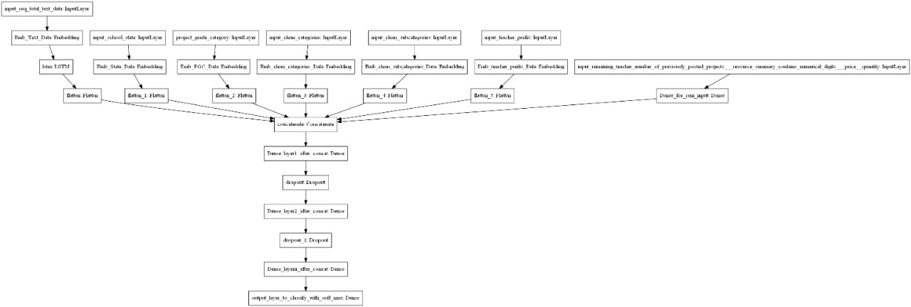
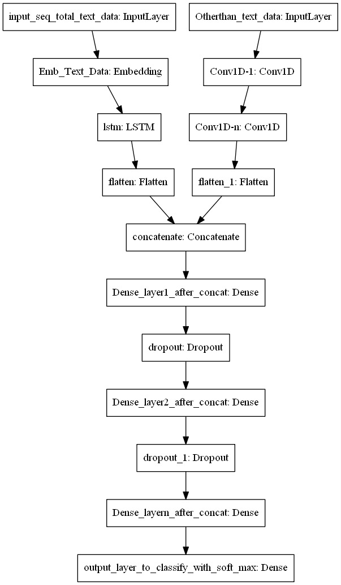

# Assignment:
## Model 1

**1. Implement Model 1 as per below**

    * Input_seq_total_text_data --- You have to give Total text data columns. After this use the Embedding layer to get word vectors. Use given predefined glove word vectors, don't train any word vectors. After this use LSTM and get the LSTM output and Flatten that output.
    * Input_school_state --- Give 'school_state' column as input to embedding layer and Train the Keras Embedding layer.
    * Project_grade_category --- Give 'project_grade_category' column as input to embedding layer and Train the Keras Embedding layer.
    * Input_clean_categories --- Give 'input_clean_categories' column as input to embedding layer and Train the Keras Embedding layer.
    * Input_clean_subcategories --- Give 'input_clean_subcategories' column as input to embedding layer and Train the Keras Embedding layer.
    * Input_clean_subcategories --- Give 'input_teacher_prefix' column as input to embedding layer and Train the Keras Embedding layer.
    * Input_remaining_teacher_number_of_previously_posted_projects.resourcesummary_contains_numerical_digits.price.quantity ---concatenate remaining columns and add a Dense layer after that.

## Model 2

      1. Train the TF-IDF on the Train data 

      2. Get the idf value for each word we have in the train data. 

      3. Remove the low idf value and high idf value words from our data. Do some analysis on the Idf values and based on those values choose the low and high threshold value. Because very frequent words and very very rare words don't give much information. (you can plot a box plots and take only the idf scores within IQR range and corresponding words)

      4. Train the LSTM after removing the Low and High idf value words. (In model-1 Train on total data but in Model-2 train on data after removing some words based on IDF values)

## Model 3

